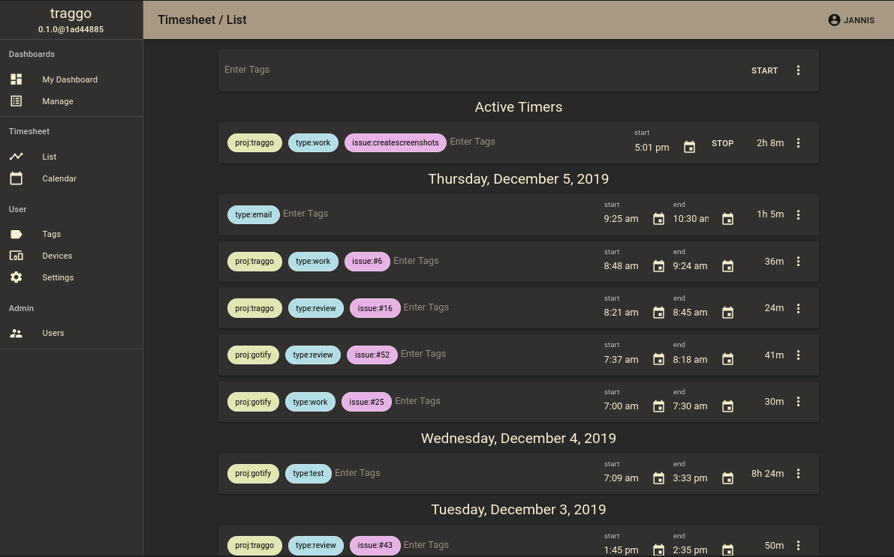
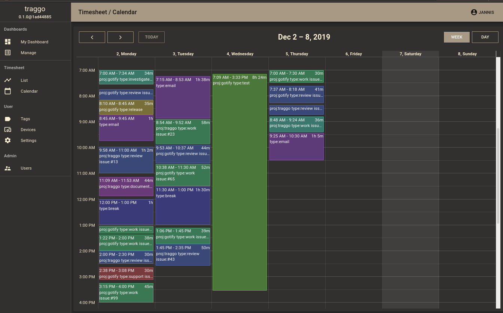
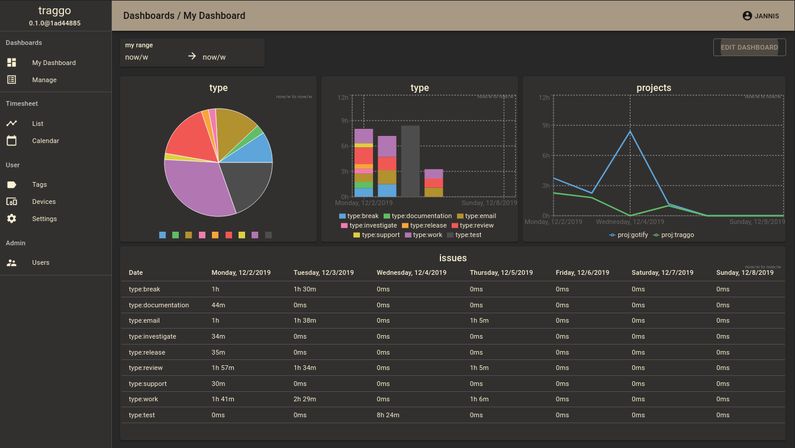

    

<h1 align="center">traggo/server</h1>

<i>tag-based time tracking</i>

    
     
    
    
    

Traggo is a tag-based time tracking tool. In Traggo there are no tasks, only [tagged](https://traggo.net/terminology/#tag) [time spans](https://traggo.net/terminology/#timespan).

With [tags](https://traggo.net/terminology/#tag), Traggo tries to be as customizable as possible, f.ex. if you work on different projects you could add a `project`-tag.
If you like to see statistics from the different things you do, you could add a `type`-tag with values like `email`, `programming`, `meeting`. 
You can do it just as you like.

If you want to use Traggo, you need to host it yourself. This way, you have the full control over your data and no third-party
may be able to read it. Have a look at our [Install Guide](install.md).

## Features

* easy to setup
* time tracking (obviously)
* customizable dashboards with diagrams
* a list and calendar view of the tracked time
* sleek web ui with multiple themes
* simple user management

---

[Install](https://traggo.net/install/) ᛫
[Configuration](https://traggo.net/config/) ᛫
[Setup Dev Environment](https://traggo.net/dev/setup/)

## Versioning
We use [SemVer](http://semver.org/) for versioning. For the versions available, see the
[tags on this repository](https://github.com/traggo/server/tags).
